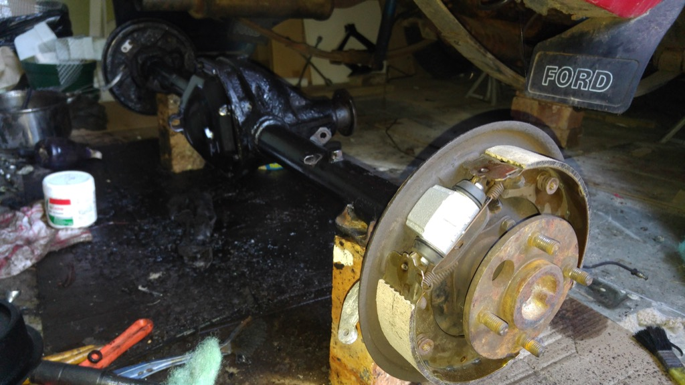
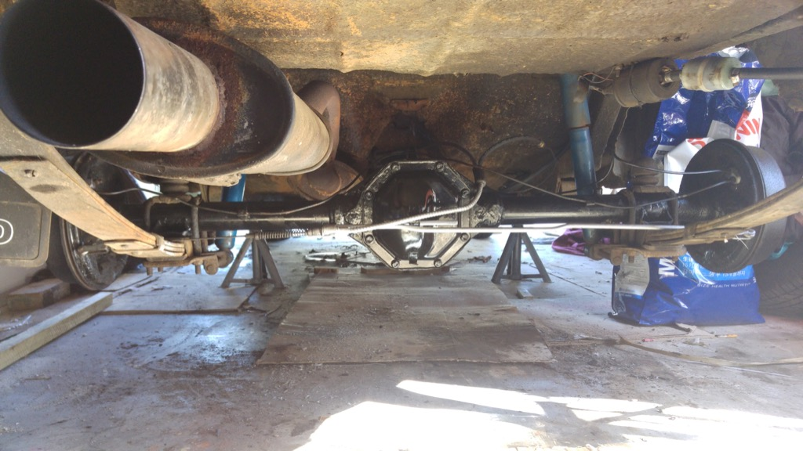
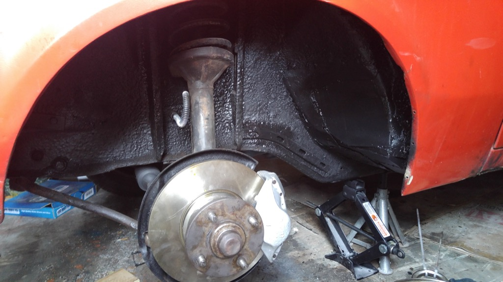

Brakes were never really great. Booster never worked. Even the new booster I got from a Bantam didnt work great.

So I went to bleed the brakes, one thing lead to another and now the diff is on the floor.

Cleaned it up  
replaced the seals and bearings  
painted    
rebuilt the slave cylinders   
replaced the brake lines  

  
  
  
  
  
  
  

Moved on to do the front brakes. New discs, renewed calipers, new lines, replaced the booster with a stock mk2
 escort booster, rebuilt the master brake cylinder

  
  
  
  
