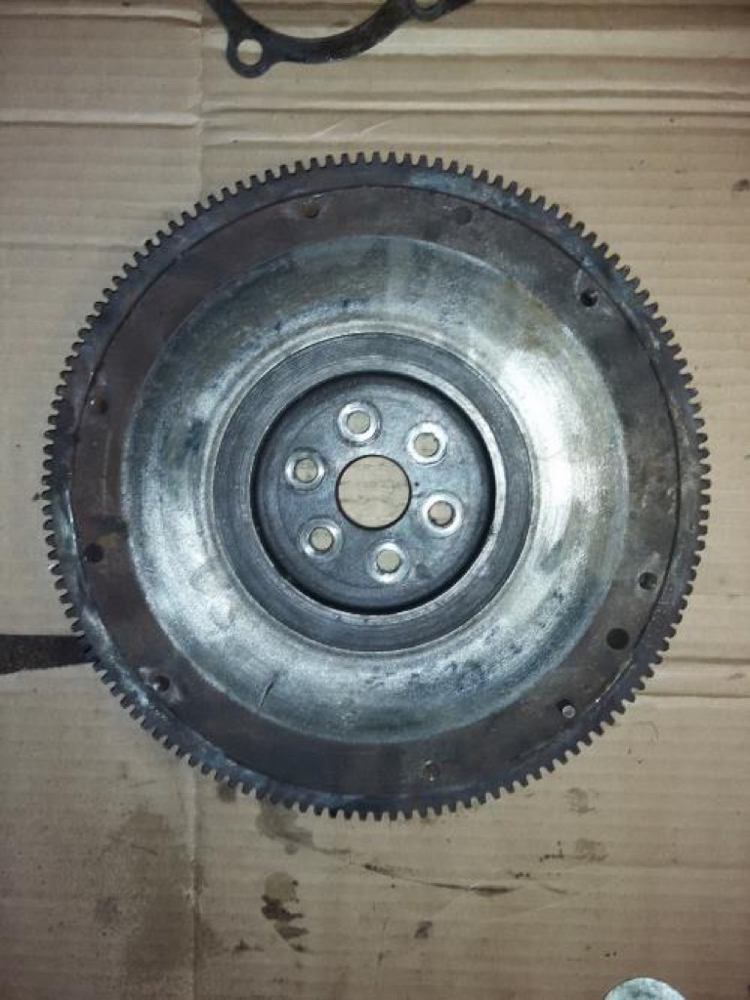
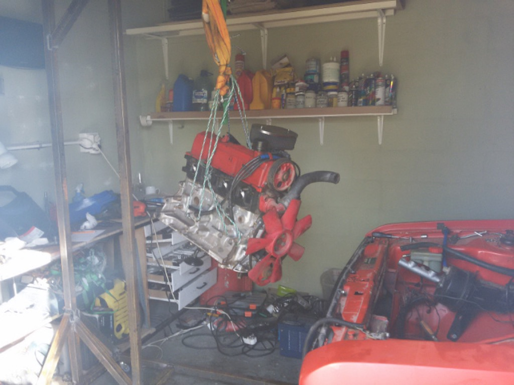

Rebuild of the sierria 2.0 SOHC motor:
* skimmed & ported & polished head
* 285 degree cam
* RS2000 alloy sump
* Reconditioned Weber DGV 32/36 Carb + K&N Filter
* New Pistons, gaskets, waterpump, valves, belts, bearings, seals, etc
* Skimmed cylinder sleeves and re-balanced crank
* Lightened flywheel
* Oil catch tank (to reduce seal breakage due to internal pressure)

  
  
  
  
  
  
  

Engine back in, wouldnt start.  
Expanded vocabulary.   
Flywheel ring gear didnt match up with starter.   
Moving the battery to the boot made for too much amp drops  
"weight reduction program" was a failure - when you have parts left after putting everything back together (oil pump shaft shim). Ran without oil, had to replace bearings again, regrind crank again.

  
  
  
  
  
  
  
  
 

