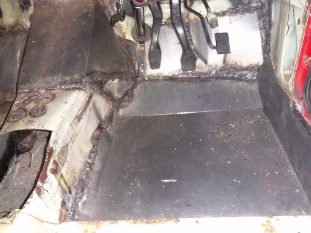
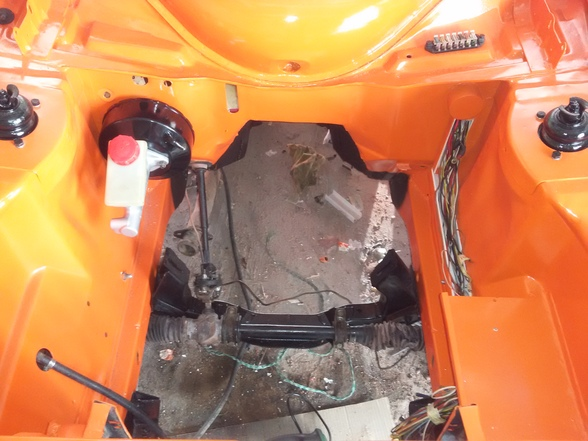

Previously, I removed the gearbox to rebuild it and while doing that, I noticed some rust on the floor.  

Stripped the interior to make sure that when the gearbox goes in, its not going to just fall out. 
For some reason, the rust was previously repaired with fiberglass.  

  

Removed all the fiberglass (always wear protective gear!) and rubber matt
"omgwtf.jpg" 
As I scraped the rubber matt off the floorpan using a heatgun, the whole gearbox tunnel would sway back and forth,
 held in place by a mere thought of metal.

  
  
  

* shopping list:
    * 1.6mm sheetmetal
    * new welding helmet 
    * moar cutting and grinding discs 

  
  
  
  

Happy with the integrity, engine is already out so might as well paint.

  
  
  

Also decided to redo the wiring because there was a lot of redundant wires and one fuse would always blow.   
I bolted on a painted piece of ducting so once set up, no wires would be exposed. I also sourced a new booster (bigger than original)
 and bolted this directly to the firewall.  

  

I got the engine back in with new stiffer engine mounts sourced locally. The motivation for "The Widow" name is that
for the last 4 years, there has always been at least one Brown or Black Widow spider living somewhere in the car.
 While most folks seemingly suffer from arachnophobia, I personally adore Widow spiders and decided to take the theme one step further

  
  
  
  
  
  
  
  
 

