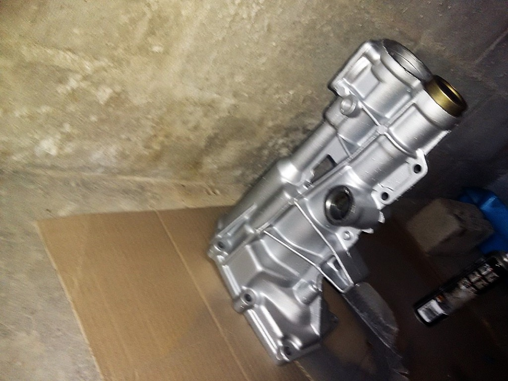
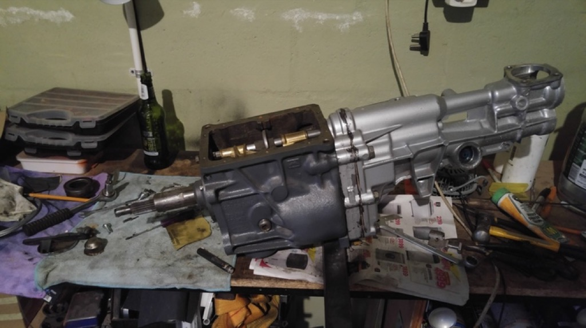
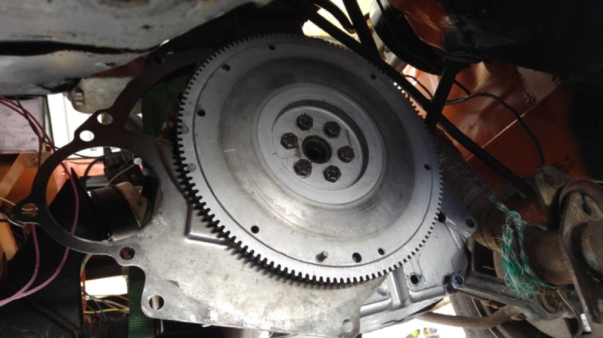

Rebuild of the Ford Type-9 5 spd gearbox:
* many oil leaks
* noisy on load
* Gearbox was lose-ish in tunnel
* Quickshift kit is sex

  
  
  
  
  
  
  
  
  
  
  
  
  
  
  
  
  
  
  
  
  
  
