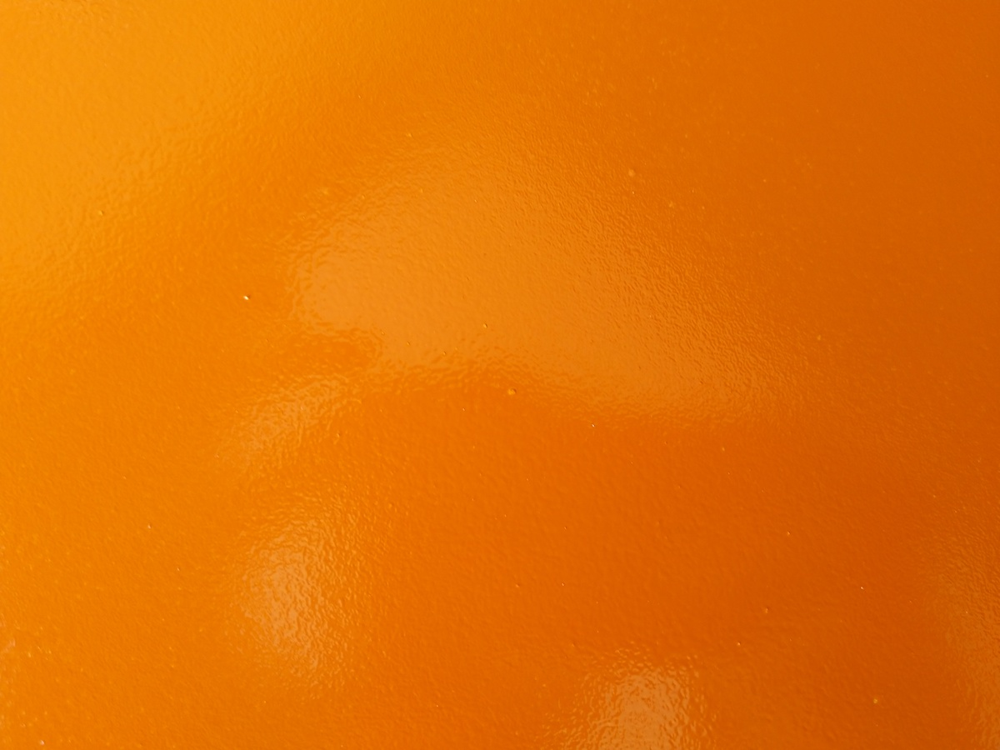

Rust is now sorted. Working on getting the body ready for paint.

Got hold of a fiberglass spoiler, I like the look.
Also like some of the things they did with the Hoonigan escort. Particularly the cut-and-tucked front fender. 

  
  
  
  
  
  
  

Took some trial and error to get my paint gun tuned in correctly. This is an example of paint being too thick and pressure too high.
  

This is better, but still needed tuning
  
  

Cracked the screen when I tried to gently remove it. Decided to vent using all available hammers. It was great; cleanup wasn't.

  

Used spray-on bondo on the areas around the doors, then used a wooden block to sand that down to try and get it straight.

  

cut-and-tucked front fender
 
  
  
  
  
  

Body lines needed a bit of work because I removed the doors when I fixed rust and applied some bondo and primer and did some sanding before I put them back on. 
  
  

All primed up, already looking promising. I kept the small garage door open a smidge, closed the big door 90%. Made the floor and walls wet to minimize floating dust. Had a fan by the big door blowing directly on a tray of water (diy dust catcher)
  
  

First layer of actual paint!
  

wtf.
  
  

Stripped paint gun, cleaned everything, sanded down panels, still happened.  
Learned that there were yellow bits in the paint. 
Go to store, buy some pantyhose, act normal.  
Worked like a charm. I sent each batch of mixed paint through 4 layers of panyhose. So much crap.

  
  
  

Got the tuning on the spray gun figured out meow.  
  

awwwyiiiissss...   
  
  

Next morning, inspect paint, bebbe widows set up shop. Lucky they waited for paint to dry first.
  
  

All done with orange. Took me a few hours to mask everything off. Lesson learned: when painting multiple colours, start with the colour thats gonna be least used. Smaller area to mask.
  
  
  
  
  

Got lucky with the doors. Masking outside and painting the inside black.
  
  
  
  

Used aerosol leak sealant to spray the fibreglass spoiler. Has a rubbery feel to it with a slight texture.
  
  

Mudflaps. I like the look of those fat rally style mudflaps, but too expensive. Got some 4mm rubber mat from the local hardware store. Used MSA Regulation guidelines for mudflaps. Math'd like a boss.
Added some sheetmetal support to make sure they dont flap around too much and stay straight after a bit of abuse.  
  
  
  
  
  
  

Rear light holders have seen some better days.
  
  

Tail light lenses were a bit faded. Couldnt find new ones. Restored with spraypaint (very lightly and at a far distance). seemed to work ok, but I'll be looking for new ones anyways.   
  

Starting to fit the outside bits again.
  
  
  

Everyone knows that bonnet pins add more horsepower. Used the location that was used for the original bonnet bumper pins. 
Screw with some grease on top.  
Close hood, open again and drill through grease marking.  Used a dremel to shape the holes nicely and sealed bare metal with primer using a brush.  Wife has a tonne of these little brushes. i'm sure she wont miss one...  

 
  
  
  
  
  
 

Got new rubbers all round. Spent a lot of time trying to get the rear window back in. Discovered the "string method" and that worked well.
  
  

Attempted to buff out scratches in windows. Didnt work too well, but they're pretty clean now.  
  
  

Parts box is getting pretty empty at this point, few bits and pieces to restore and install.  
  
  
  
  
  

Exterior is reassembled. stirring in trousers.  
  
  
  

Got some stickers made for final touches. 
  
   

Still need to fix a few spots of paint mishaps using airbrush and still need to wetsand and buff. On a bit of a time limit now though, so focussing on getting everything back together first. Will be sourcing a new rear bumper and tail light lenses.  
Next step is interior.  