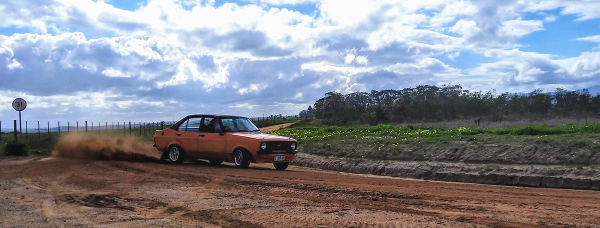

Got a weber DGAS38 carb to replace the 32/36 progressive. Cleaned, kitted and initial jetting done. 

  
  
  
  

Interior is not in too bad a shape. Decent clean made a nice difference.   
Got some nice leather-look seat covers. Removed seats, patched up holes.  
Fitted seat covers but used some wire and thread to make sure they tuck in nicely.  Will redo upholstry later.  
  
  
  
  
  

While looking at carb tuning, got hold of a vernier cam pulley and when I fiddled with the timing I stumbled across a major issue.  

There are 3 types of distributors for these pinto motors that are generally available:  
1. Pre-EFI, points based dizzy with a vacuum pot for advance, one wire coming out of the dizzy  
  

2. ESC1 EFI, reluctor-type electronic dizzy with vacuum pot for advance, two wires coming out of the dizzy  
  

3. ESCII EFI, late sierra model Hall-effect dizzy, no vacuum pot, no mechanical advance. Advance was controlled by ESCII ECU. Three wires out of the dizzy.   
  

I have the 3rd one, with a TP100 control module, but its on an early cortina pinto motor. With just these two components, there is no advance at all.  
You can set the advance timing while the car is idling at say 1000rpm, but the advance wont increase as RPM increases, so the car feels lacking at full throttle.  

So either use a ECU from a 86 sierra with this setup, or an aftermarket ECU (which you can tune with custom ignition timing maps) or get a dizzy with a vacuum advance pot.  

I got the dicktator STD.  

  
  
  

Took some time to dial in the initial distributor positioning (angle) and ended up getting some help from the local dyno shop in fear of detonation. 
Once dialed in, did a rolling road tuning session with the help of a bromego with experience on the ECU and rewarded with beer.  
So while the ECU only does the fuel pump and ignition timing, it has transformed the drive-ability, startup and overall performance drastically.  
Massive massive difference, well worth the price and not that difficult to install. Plus, makes it easier if i do decide to go EFI later.

With the tuning sorted and mapped, noticed an oil leak. My sump (RS2000 alloy) had a steel oil return tube on the side, press-fitted in.  
Wasnt that snug anymore and thats where the oil leak came from. Couldnt remove the sump with the engine in the car. sigh.   

  

Engine out, removed the steel pipe, blocked the hole, took the opportunity to renew the rear main seal and inspect the bearings, they looked great phew.

Chucked the motor back in and took the opportunity to renew the cooling system.

  
  
  
  

Replaced the static fan with an electric one, new waterpump, thermostat, overflow tank and cleaned up the radiator. Cools properly again now.

Also made a battery holder, since its required for roadworthy

  

I wanted a oil pressure gauge. Because reasons. Had to get creative with gauge cluster real estate

Pic before I started

  

mods...

  
  
  
  
  
  
  
  
  
  
  
  
  
  
  
  

Also got some new seatbelts. Previous ones were not retractable and are now 40 years old 
  
  

Flatsanded the entire thing after the paint job. Learned that small cars become very big when approached with sandpaper.  
Started with 800 grit dry, then 1200 wet, ended with 2000.  
Also, this is why we wear protective gear.

  
  

Once done, took it to a place to get polished/detailed because my arms were tired.

They did a nice job. 

  
  
  
 

  
  
  
  

